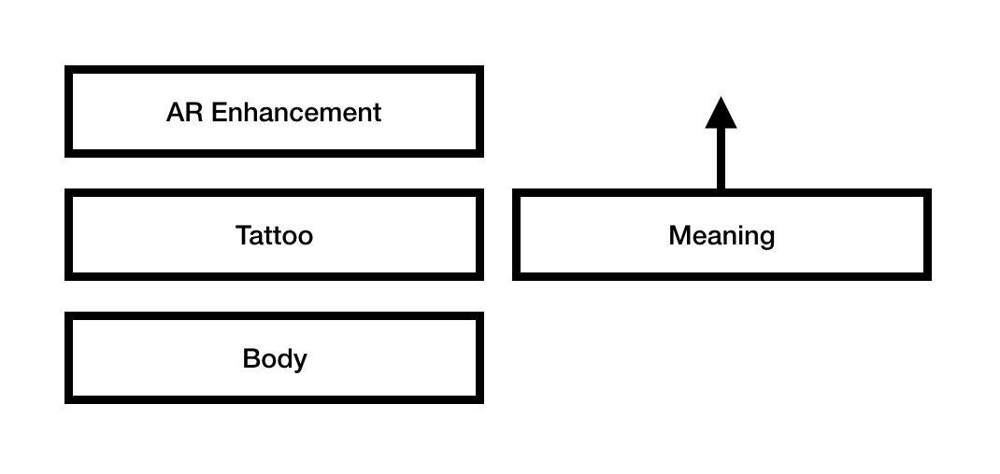
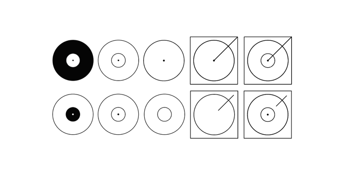
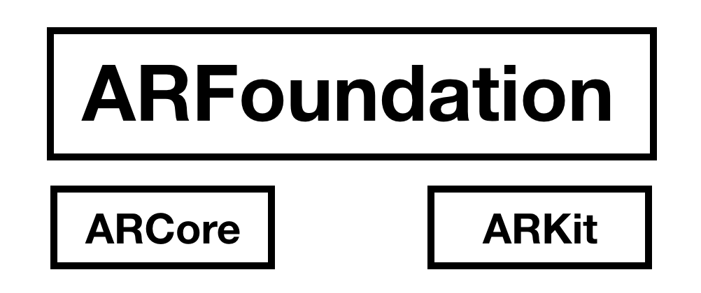
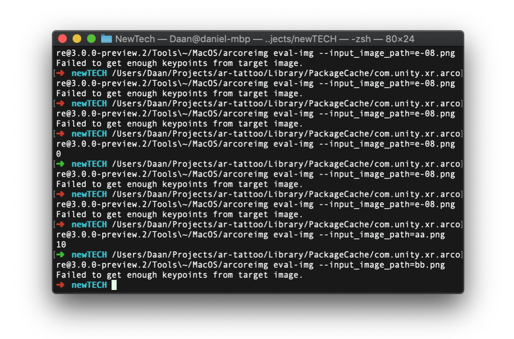
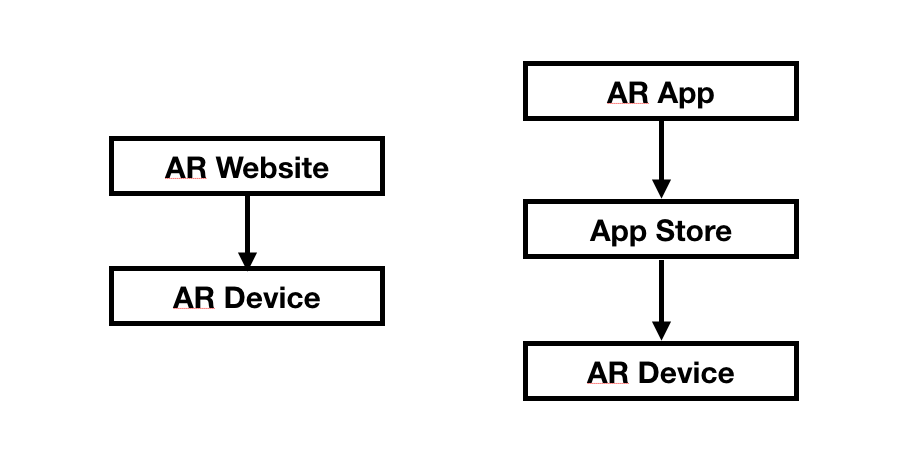

# Documentation New Technologes
_By Daan Korssen, student no. 3032555_

1. (TECH) Quality of experiments/prototypes:
- Demonstrable application of the acquired knowledge of technology
2. (TECH/DES/ORGA/PROF) Quality of documentation:
- The project documentation is available on an open platform (Github, Instructables, etc.)
Comprises at least:
-a clear description of the design/experiment (conceptual, technical)
-clear substantiation of technical and design choices
-use of visual material

## Augmented Reality Tattoo
Let's argue that all tattoo's have a meaning to their bearer; some commemorate other people or events, some signify their love for another soul, others were gotten spontaneously or purely for aesthetic reasons. Even 'I got this tattoo because I liked it' is a valid reason, which in turn is its meaning.

Since traditional tattoos are permanent, their (un)intended meaning is permanent too. When using Augmented Reality, however, the 'meaningfulness' of a tattoo could be moved into the digital layer, thus becoming permutable. 

What is physically left on the skin will then be merely a container for meaningfullness, like an empty box that can be filled digitally. 

When taking the empty box metaphor very literally, and create 

Abstract LP play. 

For this experiment I decided to use [ARFoundation](https://docs.unity3d.com/Packages/com.unity.xr.arfoundation@3.0/manual/index.html), a Unity package that serves as an abstraction layer of the native ARCore and ARKit API's on respectively Android and iOS, allowing developers to use one codebase to deploy to two native AR apps. ARFoundation is maintained by Unity and 

I have worked with ARFoundation before, but my previous experiments were limited to Plane Tracking. Image Tracking was new to me. 

After searching for a bit, I found the ARCore commandline tools and used that to rapidly test out new designs.

As you can see in the terminal, most of my attempts were apparently so bad that a score could not even be calculated, and the highest score I managed to obtain was 10. The ARCore documentation recommends a minimal score of 75.

## WebVR 
Around the same time as the failure of experiment 1, I visited Mozilla's View-Source Conference. The talks and conversations at the conference got me very excited about WebVR and -XR, so I decided to experiment with this technology for my second attempt.

WebVR and -XR are Browser APIs that can be used to emerse internet users that are browsing the web using a mixed or virtual reality headset. 

## PMI
### Positive insights
- Being able to open VR worlds from the browser is a big deal for avoiding walled gardens like app stores. 

### Negative insights
- Image Tracking in ARCore was way less advanced than I had anticipated. I should have started experimenting with it at an earlier stage to test feasability instead of focusing so much on the conceptual part.
- The Oculus Quest was not available at the Uitleen yet, so I had to borrow one elsewhere.
- Debugging for Web on an external device is hard and annoying. I did have a Console inside the VR world, but this worked very minimally. Routing the console logs to a computer would be possible but I did not manage to after a few attempts.
  
### Interesting insights
- Interaction in AR tattoos is something that is still very minimally explored, but might have promising applications in the future.
- It is a very strange situation that the WebVR API is deprecated, while its successor, the WebXR API, is not finalized yet. 

