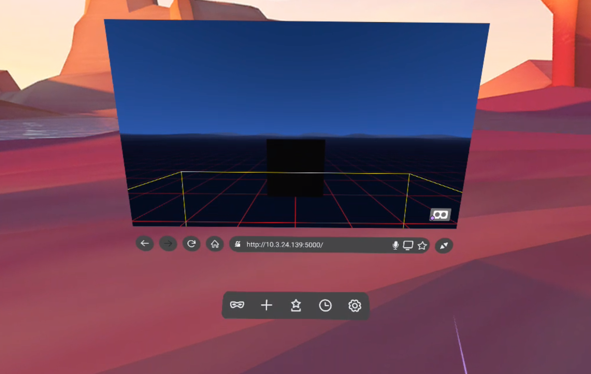
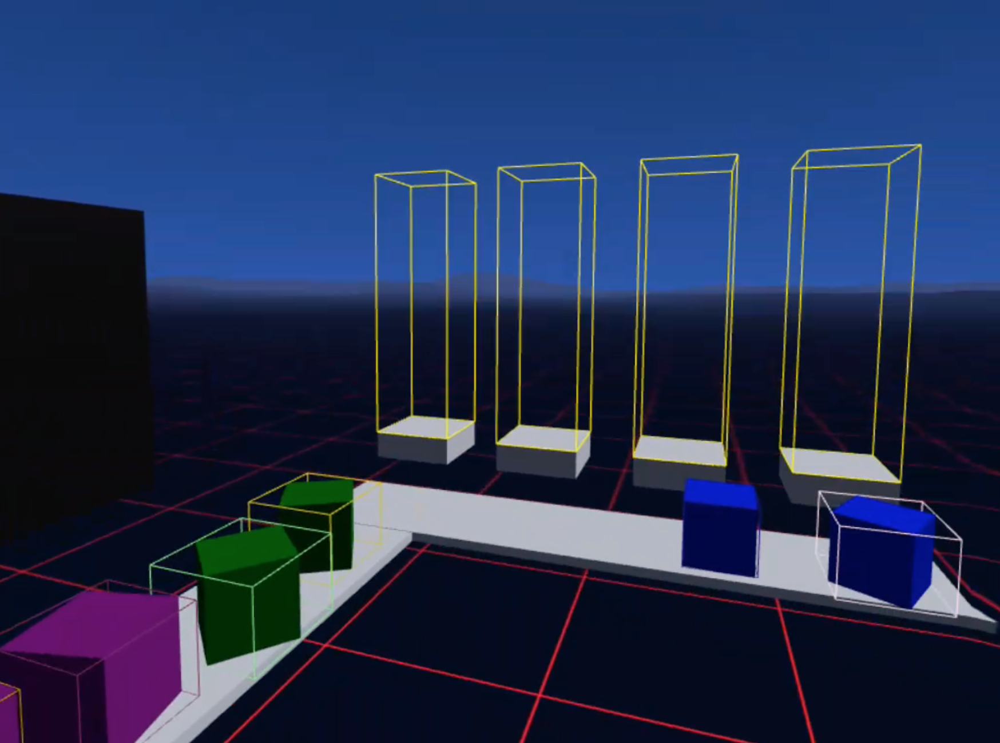

# Documentation New Technologes
_By Daan Korssen, student no. 3032555, [Presentation slides (PDF)](https://studenthome.hku.nl/~daan.korssen/homework/year-2/NewTech_Eindpresentatie.pdf)_

After seeing [several people](https://twitter.com/singareddynm/status/1163071327248572421) on the internet creating Augmented Reality tattoos, I decided I wanted to make one myself. All existing AR tattoos I found were simple animations or 3D object overlays, so I set out to design something interactive.

## Augmented Reality Tattoo
Let's argue that all tattoo's have a meaning to their bearer; some commemorate events or places, some signify their love for another soul, others were gotten spontaneously or purely for aesthetic reasons, which in turn becomes its meaning.

Since traditional tattoos are permanently etched into your skin, their (un)intended meaning is permanent too. When using Augmented Reality, however, the 'meaningfulness' of a tattoo could be moved away from the physical into the digital layer, thus becoming permutable. 

What is physically left on the skin will then merely be a container for meaningfullness, like an empty box that can be filled digitally. 

When taking the empty box metaphor very literally, something like the icon below could be tattooed, and then an AR app could overlay the contents of the box. Everytime you have something new that is important to you, you can put it in the digital AR layer that overlays the physically inked box. This could be anything from a voice memo to a photo.

This idea was too broad for me, and I decided to take the same concept but give it a theme; an empty record player tattoo in which the AR layer shows which song or vinyl record is currently inserted. This way I can express my love for music without permanently committing to a particular song or artist. Whenever I have a new favourite song, I can 'put it inside' my tattoo in the AR layer. Then, everytime I look at my tattoo through the AR app I will then be able to see and hear the selected song.

Above are some of the minimalistic sketches I made for the tattoo.

To make a prototype for this concept I decided to use [ARFoundation](https://docs.unity3d.com/Packages/com.unity.xr.arfoundation@3.0/manual/index.html), a Unity package that serves as an abstraction layer of the native ARCore and ARKit API's on respectively Android and iOS, allowing developers to use one codebase to deploy to two platforms. ARFoundation is maintained by Unity and still in rapid development. I have worked with ARFoundation before, but it turned out the whole package changed since the last time I used it. My previous experiments were limited to Plane Tracking, and this time I would need its Image Tracking features. 

I quickly ran into problems when adding my tattoo sketches to the ARFoundation instance. It turned out that my images weren't complex enough to be recognized easily.

After searching for a bit inside the ARFoundation package, I found the ARCore commandline tools and used that to rapidly test out new designs instead of having to import them into Unity every time.

As you can see in the terminal, most of my attempts were apparently so bad that a score could not even be calculated, and the highest score I managed to obtain was 10. The ARCore documentation recommends a minimal score of 75.

I tried many different approaches using thicker lines, bigger sizes, more complex drawings, even drawing on my arm with permanent marker and taking pictures of it, but nothing worked good enough to get it as an actual tattoo. Eventually, I gave up.

## WebVR 
Around the same time as the failure of the first experiment, I visited Mozilla's View-Source Conference. The talks and conversations at the conference got me very excited about WebVR and -XR, so I decided to experiment with this technology for my second attempt.

WebVR and -XR are Browser APIs that can be used to immerse users that are browsing the web using a mixed or virtual reality headset by opening a virtual world right from the browser window. 

This time, I decided to not focus too long on the concept and just start experimenting with the technology as soon as possible. To limit myself a bit, I decided to do something with music creation inside VR. 

Above is a screenshot of the Firefox Reality browser, showing a 2D render of my 'website' in the 3D browser environment. With the goggles icon in the bottom right corner of my website, the WebVR APIs are called to open the 3D world contained in my website, resulting in the following view.

The final product is a WebVR environment where you can pick up noteblocks, each representing a different musical note. By stacking them inside the note platforms, you can create simple melodies.

I used [Tone.js](https://tonejs.github.io) for music generation, and the [AFRame](https://aframe.io) framework to work with WebVR, hoping that it would make things simpler, but even with the help of this framework the development felt like navigating through a barely explored jungle. Simple things like Box colliders for detecting if notes were inside the note stacks took me hours, and still work very buggy. 

## PMI
### Positive insights
- Being able to open VR worlds from the browser has big potential for bypassing walled gardens like app stores, as well as bringing the open nature of the web to VR, hopefully avoiding a scary future in which there will be one dominant VR metaverse, like [Facebook Horizon](https://www.oculus.com/blog/introducing-facebook-horizon-a-new-social-vr-world-coming-to-oculus-quest-and-the-rift-platform-in-2020/?locale=en_US).

### Negative insights
- Image Tracking in ARCore was way less advanced than I had anticipated. I should have started experimenting with it at an earlier stage to test feasability instead of focusing so much on the conceptual part.
- The Oculus Quest was not available at the Uitleen yet, so I had to borrow one elsewhere.
- Debugging for web on an external device is hard and annoying. I did have a console inside the VR world, but this was a very half-baked solution. Routing the console logs to a computer would have been possible but is rather complicated.
  
### Interesting insights
- Interaction in AR tattoos is something that is still very minimally explored, but might have promising applications in the future.
- It is a very strange situation that the WebVR API is deprecated, while its successor, the WebXR API, is not finalized yet. Following the development of WebXR will be an interesting journey.

